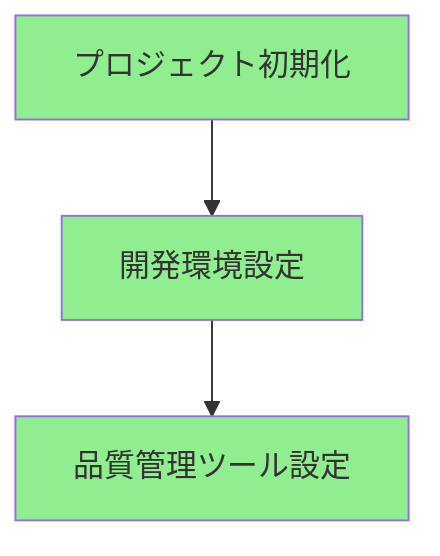

# Progress Tracking

## 現在の実装状態

### 完了した項目

1. プロジェクト構造
   - ✅ 基本ディレクトリ構造
   - ✅ 設定ファイル配置
   - ✅ ドキュメント構造

2. 開発環境
   - ✅ Python環境設定
   - ✅ コードフォーマッター設定
   - ✅ 静的型チェック設定

3. 品質管理
   - ✅ リンター設定
   - ✅ フォーマッター設定
   - ✅ スペルチェック設定

### 進行中の項目
1. コア機能実装
   - 🔄 Agent Core基本実装
   - 🔄 LLM統合の初期実装
   - 🔄 基本的なコンテキスト管理

### 未着手の項目
1. 拡張機能
   - ⬜ 高度なエラー処理
   - ⬜ パフォーマンス最適化
   - ⬜ セキュリティ強化

2. テスト環境
   - ⬜ テストフレームワーク設定
   - ⬜ テストケース実装
   - ⬜ CI/CD設定

3. ドキュメント
   - ⬜ APIドキュメント
   - ⬜ 開発者ガイド
   - ⬜ ユーザーガイド

## 次のマイルストーン

### マイルストーン1: コア機能完成
- [ ] Agent Core機能の完成
- [ ] LLM統合の完全実装
- [ ] コンテキスト管理の完成

### マイルストーン2: テストと最適化
- [ ] テストスイートの実装
- [ ] パフォーマンス最適化
- [ ] エラー処理の強化

### マイルストーン3: テスト環境構築
- [ ] テストフレームワークの導入
- [ ] 基本テストケースの実装
- [ ] CI/CDパイプラインの構築

## 既知の課題

### 技術的課題
1. LLM統合の実装
   - レスポンス処理の最適化
   - エラーハンドリングの実装
   - コンテキスト管理の効率化

2. パフォーマンス最適化
   - レスポンス時間の要件
   - メモリ使用効率
   - スケーラビリティ

### プロジェクト課題
1. 設計ドキュメントの充実
2. テスト戦略の具体化
3. 開発フローの確立
