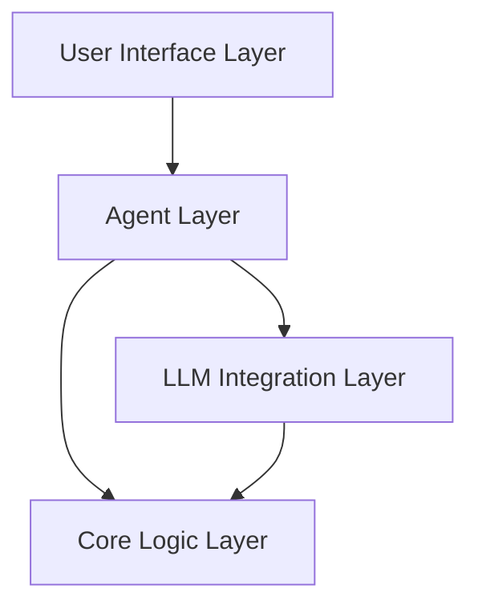

# System Patterns

## アーキテクチャ設計

### レイヤードアーキテクチャ


## 設計原則

### 1. モジュラー設計
- 独立した機能モジュール
- 疎結合な依存関係
- テスト可能な単位での分割

### 2. 型安全性
- 静的型チェックの活用
- カスタム型の定義
- 型ヒントの徹底

### 3. エラー処理
- 明示的なエラー型
- Result型パターンの採用
- エラーの追跡可能性

### 4. テスト戦略
- ユニットテスト重視
- 振る舞い駆動開発（BDD）
- テストカバレッジの維持

## コアコンポーネント

### Agent Core
- ユーザー入力の処理
- コンテキスト管理
- 応答生成の制御

### LLM Integration
- モデルとの通信
- プロンプト管理
- レスポンス処理

### Context Manager
- 会話履歴の管理
- 状態の保持
- メモリー管理

## 実装パターン

### 1. Factory Pattern
```python
class AgentFactory:
    @staticmethod
    def create(config: Config) -> Agent:
        pass
```

### 2. Strategy Pattern
```python
class ResponseStrategy(Protocol):
    def generate(self, context: Context) -> Response:
        pass
```

### 3. Repository Pattern
```python
class ContextRepository(Protocol):
    def save(self, context: Context) -> None:
        pass
    def load(self, id: str) -> Context:
        pass
```

## 品質管理

### 1. コード品質
- リンターの設定
- 型チェックの厳格化
- フォーマッターの適用

### 2. テスト品質
- テストカバレッジ目標
- テストパターンの標準化
- CI/CDでの自動テスト

### 3. ドキュメント品質
- docstringの標準化
- APIドキュメントの自動生成
- 設計文書の維持
